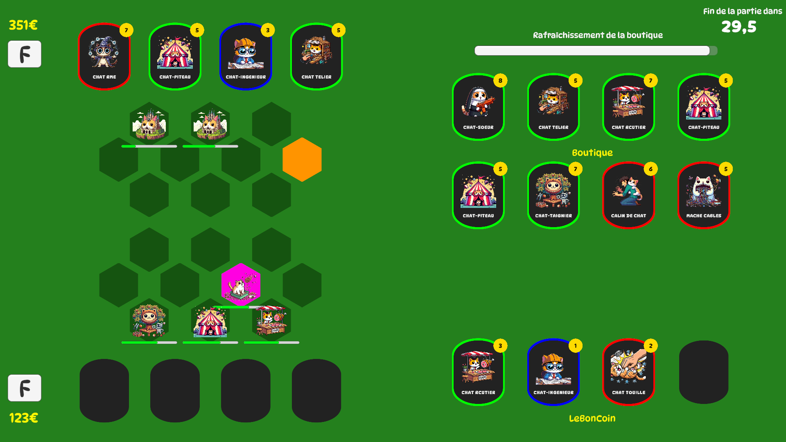

# MEW NATION 🐱🎴


<p style="text-align:center;">
    
</p>

**A strategic card game developed with Unity**.

Made by **Pierre Magieu** and **Sebastian Caron**.

## Installation

### Requirements  
- **Unity 2021+**  
- **Git** (to fetch the project)  

### 🔧 Install and Run  
1. **Clone the project**  
   ```bash
   git clone https://github.com/SebastianCaron/ChatArchitectePure.git
   cd ChatArchitectePure
   ```
2. **Open with Unity**  
   - Launch **Unity Hub**  
   - Add the project folder  
   - Open the main scene  

3. **Play!** 🎮  

## 🎮 Overview  

*Mew Nation* is a competitive card game where two players battle to accumulate the most money in 2 minutes. Buy cards, place buildings, attack your opponent, and adapt to random events to claim victory!  

## 🌟 Game Rules  

### ⏳ Game Duration  
Each match lasts **2 minutes**. The goal is to have more money than your opponent when time runs out.  

### 💰 How to Earn Money?  
- **Passive income**: Every second, you receive **1 gold**.  
- **Card effects**: Some cards increase your income, while others make your opponent lose money.  

### 🎮 Controls  
- **Player 1**:  
  - Move the selector → **Arrow keys**  
  - Buy/Place a card → **Space bar**  
- **Player 2**:  
  - Move the selector → **WASD keys**  
  - Buy/Place a card → **Enter key**  

### 🃏 Card Types  
Three types of cards are available:  
- **Building Cards (Green)** 🏠: Generate money or protect nearby buildings.  
- **Attack Cards (Red)** 💥: Deal damage to enemy buildings.  
- **Support Cards (Blue)** 🛠️: Heal or reinforce allied buildings.  

### 🎲 Random Events  
Every **40 seconds**, a random event may occur:  
- **ChatCGT** 😾: Your cards go on strike, and your buildings make you lose money.  
- **ChatFéPlaisir** 🤑: Shop prices are **reduced by 50%**.  
- **Chatastrophe** 🔥: **All buildings are destroyed**.  


## 🏰 Contributing  
If you wish to contribute, feel free to submit a **pull request** or report any bugs in the **issues** section.  

